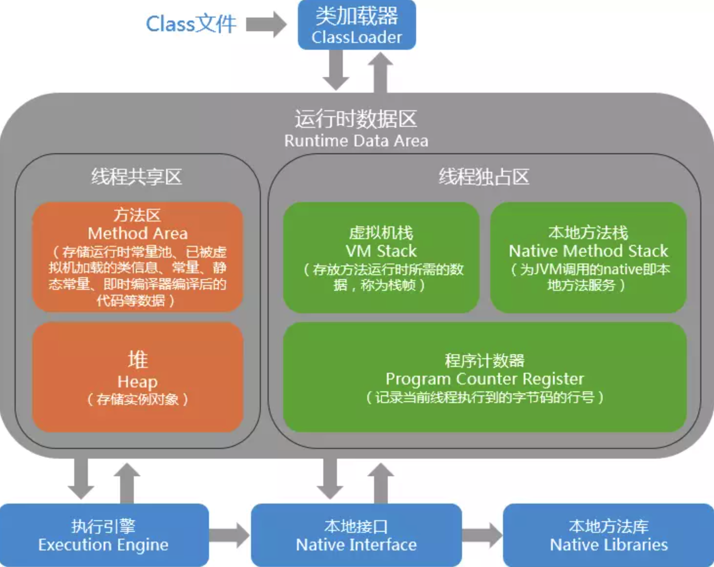

# java 垃圾回收

## jvm 内存模型

### 解析

1. 方法区
    - 保存在着被加载过的每一个类的信息（虚拟机加载的类信息（类的版本、字段、方法、接口），常量，静态变量，即时编译器编译后的代码等数据）；这些信息由类加载器在加载类的时候，从类的源文件中抽取出来；static变量信息也保存在方法区中。
    - 可以看做是将类（Class）的元数据，保存在方法区里。
    - 方法区逻辑上属于堆的一部分，但是为了与堆进行区分，通常又叫“非堆”。
    - HotSpot虚拟机使用永久代来实现方法区，使得HotSpot虚拟机的垃圾收集器可以像管理堆内存一样来管理这部分内存，能省去专门为方法区编写内存管理代码工作。所以开发者喜欢将方法区称为永久代，本质上两者并不等价，对于其他虚拟机来说不存在永久代的概念。
    - 方法区是线程共享的；当有多个线程都用到一个类的时候，而这个类还未被加载，则应该只有一个线程去加载类，让其他线程等待。
    - 方法区的大小不必是固定的，**JVM**可以根据应用的需要动态调整。**JVM**也可以允许用户和程序指定方法区的初始大小，最小和最大限制。
    - 方法区同样存在垃圾收集，因为通过用户定义的类加载器可以动态扩展Java程序，这样可能会导致一些类，不再被使用，变为垃圾。这时候需要进行垃圾清理。
2. 堆
    - **JVM**管理的最大的一块内存区域，存放着对象的实例，是线程共享区。
    - 堆是垃圾回收器主要管理的一块区域,被称为"GC堆"
    - 分为**新生代**(Eden空间,From Survivor空间,To Survivor空间),**老年代**
    - JAVA堆可以处于物理上不连续的内存空间中，只要逻辑上是连续的即可。
    - 可通过参数 -Xmx -Xms 来指定运行时堆内存的大小，堆内存空间不足也会抛OutOfMemoryError异常。
3. 虚拟机栈
    - 虚拟机栈（Java Virtual Machine Stacks）是线程隔离的，每创建一个线程时就会对应创建一个Java栈，即每个线程都有自己独立的虚拟机栈。这个栈中又会对应包含多个栈帧，每调用一个方法时就会往栈中创建并压入一个栈帧，栈帧存储局部变量表、操作栈、动态链接、方法出口等信息，每一个方法从调用到最终返回结果的过程，就对应一个栈帧从入栈到出栈的过程。

    - 虚拟机栈是一个后入先出的数据结构，线程运行过程中，只有处于栈顶的栈帧才是有效的，称为当前栈帧，与这个栈帧相关联的方法称为当前方法，当前活动帧栈始终是虚拟机栈的栈顶元素。

    - 局部变量表存放了编译期可知的各种基本数据类型和对象引用类型。通常我们所说的“栈内存”指的就是局部变量表这一部分。
    - 局部变量表所需的内存空间在编译期间完成分配，当进入一个方法时，这个方法需要在帧分配多少内存是固定的，运行期间不会改变局部变量表的大小。
    - 64位的long和double类型的数据会占用2个局部变量空间，其余的数据类型只占用1个。
4. 本地方法栈
    - 本地方法栈的功能和特点类似于虚拟机栈，均具有线程隔离的特点以及都能抛出StackOverflowError和OutOfMemoryError异常。
    - 不同的是，本地方法栈服务的对象是JVM执行的native方法，而虚拟机栈服务的是JVM执行的java方法。
    - HotSpot虚拟机不区分虚拟机栈和本地方法栈，两者是一块的。
5. 程序计数器
    - 程序计数器（Program Counter Register）是JVM中一块较小的内存区域，保存着当前线程执行的虚拟机字节码指令的内存地址（可以看作当前线程所执行的字节码的行号指示器）。
    - 如果线程执行的是java方法，这个计数器记录的是正在执行的虚拟机字节码指令的地址（可以理解为上图所示的行号），如果正在执行的是native方法，这个计数器的值为undefined。
    - JVM的多线程是通过线程轮流切换并分配CPU执行时间片的方式来实现的，任何一个时刻，一个CPU都只会执行一条线程中的指令。为了保证线程切换后能恢复到正确的执行位置，每条线程都需要有一个独立的程序计数器，各线程间的程序计数器独立存储，互不影响。
    - 此区域是唯一一个在java虚拟机规范中没有规定任何OutOfMemoryError情况的区域，因为程序计数器是由虚拟机内部维护的，不需要开发者进行操作。
    - 栈的大小可以固定也可以动态扩展。

    - 在固定大小的情况下，JVM会为每个线程的虚拟机栈分配一定的内存大小（-Xss参数），因此虚拟机栈能够容纳的栈帧数量是有限的，若栈帧不断进栈而不出栈，最终会导致当前线程虚拟机栈的内存空间耗尽，会抛出StackOverflowError异常。
    - 在动态扩展的情况下，当整个虚拟机栈内存耗尽，并且无法再申请到新的内存时，就会抛出OutOfMemoryError异常。
    - 在单个线程下，无论是由于栈帧太大，还是虚拟机栈容量太小，当内存无法分配的时候，虚拟机抛出的都是 StackOverflowError 异常，而不是OOM。）

## 垃圾回收器

**Serial**,**Serial Old**,**ParNew**,**Parallel Scavenge**, **Parallel Old**,**CMS**,**G1**

- 分类
    - 使用位置
    **新生代**: Serial,ParNew,Parallel Scavenge,G1
    **老年代**: CMS,Serial Old,Parallel Old,G1
    - 单线程和多线程
    **单线程**: Serial,Serial Old
    **多线程**: Par